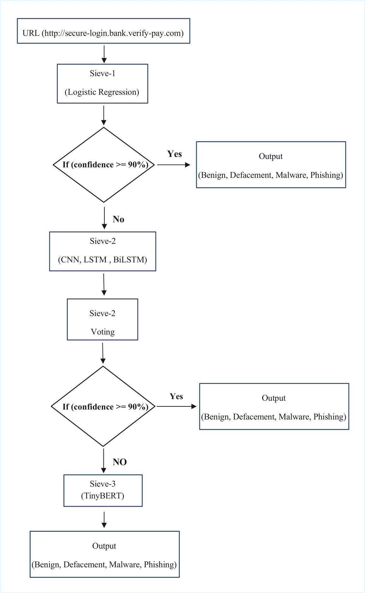

# Neural Sieve Cascade (NSC)

Neural Sieve Cascade (NSC) is a three-stage malicious URL detection framework designed to balance speed, accuracy, and real-time feasibility.

## Overview
Instead of sending every URL directly to a heavy model, NSC filters URLs progressively through three sieves:

### Sieve-1: Logistic Regression + TF-IDF
- Fast lexical filtering
- Character-level TF-IDF representation
- Accepts predictions with confidence >= 0.90

### Sieve-2: Deep Learning Ensemble
- CNN for lexical tricks and local patterns
- LSTM for sequential dependencies
- BiLSTM for forward and backward context
- Soft voting for robust classification
- Accepts predictions with confidence >= 0.90

### Sieve-3: TinyBERT
- Handles the hardest and most ambiguous URLs
- Captures contextual and adversarial manipulations
- Used only when earlier sieves are uncertain

## Classes
- Benign
- Defacement
- Malware
- Phishing

## Key Results
- Final pipeline accuracy: 97.92%
- Sieve-1 accuracy: 99.00%
- Sieve-2 voting accuracy: 91.37%
- Sieve-3 TinyBERT accuracy: 94.86%

## Project Assets

### Workflow


### Accuracy Comparison


### Confusion Matrix


### Precision Comparison


### Recall Comparison


### F1-score Comparison


## Repository Structure
```text
.
├── assets/
│   └── images/
├── data/
│   └── malicious_phish_CSV.csv
├── docs/
├── notebooks/
│   └── NSC_Final.ipynb
├── paper/
│   └── NSC_intake_report.md.txt
├── src/
├── README.md
├── requirements.txt
└── .gitignore