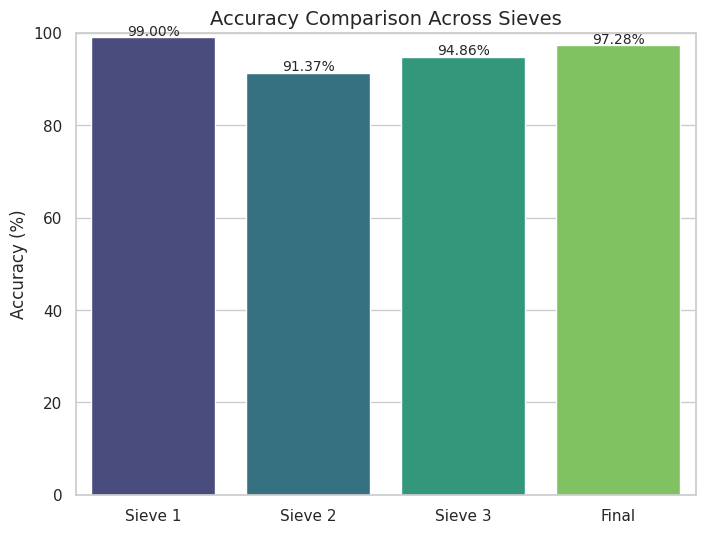
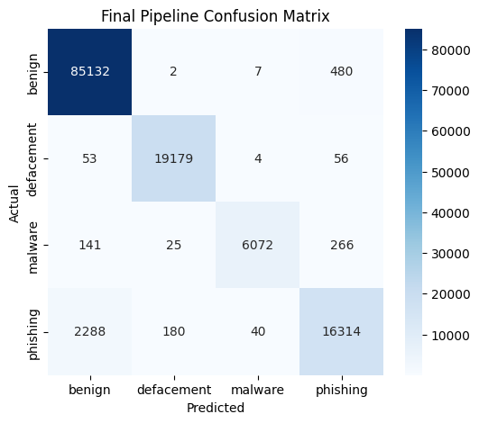
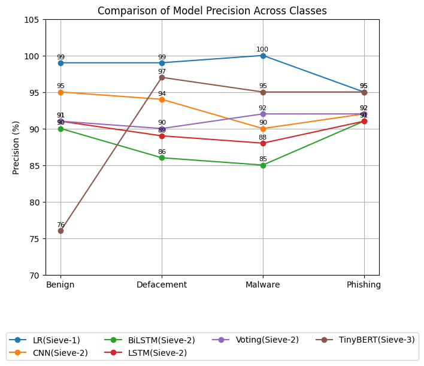
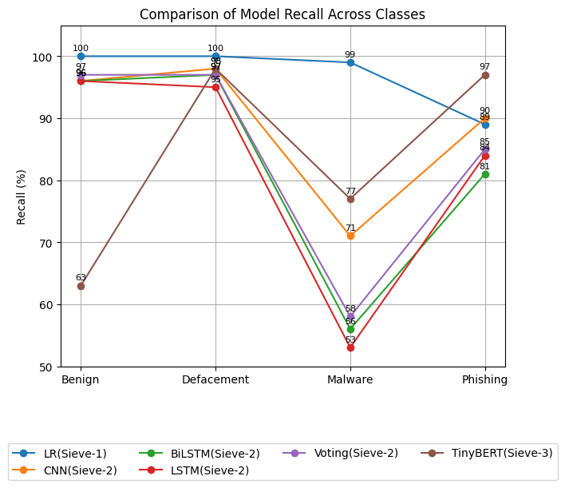
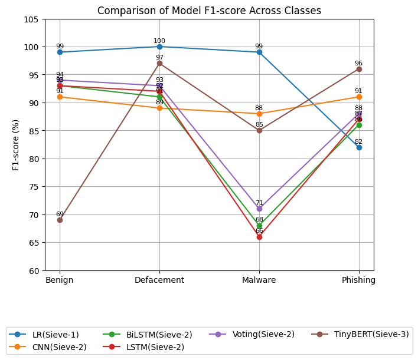

# Neural Sieve Cascade (NSC)

Neural Sieve Cascade (NSC) is a **confidence-driven three-stage malicious URL detection framework** designed to balance **speed**, **accuracy**, and **real-time feasibility**. Instead of sending every URL directly to a heavy deep model, NSC progressively filters URLs through multiple sieves: a lightweight lexical model first, a deep learning ensemble second, and a transformer-based final resolver for the hardest cases.

This project performs **four-class malicious URL classification** across:
- **Benign**
- **Defacement**
- **Malware**
- **Phishing**

---

## Highlights

- Confidence-driven **three-stage malicious URL detection pipeline**
- Combines **TF-IDF + Logistic Regression**, **CNN/LSTM/BiLSTM voting**, and **TinyBERT**
- Supports **four-class classification**: benign, defacement, phishing, malware
- Achieved **97.92% final accuracy** on a **651,191 URL** dataset
- Designed for **real-time efficiency** by escalating only low-confidence samples
- Includes **workflow diagram, result plots, project paper, and end-to-end notebook**

---

## Project Motivation

Malicious URLs remain one of the most common entry points for cyberattacks. They are widely used in:
- phishing campaigns
- malware delivery
- credential theft
- website defacement
- brand spoofing and social engineering attacks

Traditional blacklist and rule-based systems are useful, but they often fail against:
- newly generated malicious URLs
- obfuscated domains
- adversarial token manipulations
- context-dependent phishing patterns

A practical malicious URL detection system should therefore be:
- **fast enough for real-time traffic**
- **accurate enough for security use**
- **robust enough for ambiguous and adversarial URLs**

Neural Sieve Cascade was designed to address that trade-off.

---

## Core Idea

The main idea behind NSC is simple:

> Easy URLs should be classified quickly, while only difficult URLs should consume deeper and more expensive models.

This leads to a **three-stage cascade**:

1. **Sieve-1** resolves obvious cases using a lightweight model  
2. **Sieve-2** handles harder cases using an ensemble of deep sequence models  
3. **Sieve-3** processes only the most ambiguous URLs using TinyBERT  

This staged design improves computational efficiency while preserving high final detection performance.

---

## Workflow

<p align="center">
  
</p>

---

## System Architecture

### Sieve-1: Logistic Regression + TF-IDF
The first stage acts as a **fast statistical gatekeeper**.

#### Method
- Character-level **TF-IDF**
- **Logistic Regression** classifier

#### Role
- Captures lightweight lexical signals
- Quickly separates obvious benign or malicious patterns
- Handles the majority of URLs with minimal latency

#### Confidence Rule
If the maximum prediction confidence is **>= 0.90**, the prediction is accepted.  
Otherwise, the URL is escalated to **Sieve-2**.

---

### Sieve-2: Deep Learning Ensemble
The second stage handles URLs that are not confidently resolved by Sieve-1.

#### Ensemble Components
- **CNN**
- **LSTM**
- **BiLSTM**

#### Why these models?
- **CNN** captures local lexical distortions and short character-level patterns
- **LSTM** captures long-range sequential dependencies across URL tokens
- **BiLSTM** improves contextual understanding by processing the sequence in both directions

#### Ensemble Strategy
The three models are combined using **soft voting**.

#### Confidence Rule
If the ensemble confidence is **>= 0.90**, the prediction is accepted.  
Otherwise, the URL is escalated to **Sieve-3**.

---

### Sieve-3: TinyBERT
The final stage is reserved for the hardest and most ambiguous URLs.

#### Role
- Captures long-distance dependencies
- Handles adversarial token insertions
- Better understands context-rich and semantically difficult patterns
- Improves resolution of phishing and malware cases that may confuse shallow or sequence-only models

#### Configuration
TinyBERT is used as the final transformer-based resolver for samples that remain uncertain after the first two sieves.

---

## Confidence-Based Controller

A confidence-driven routing strategy controls movement between stages:

- **Sieve-1** accepts predictions when confidence is **>= 0.90**
- **Sieve-2** accepts predictions when confidence is **>= 0.90**
- **Sieve-3** produces the final output for the remaining cases

This prevents expensive models from being used on every URL and keeps the pipeline practical for real-time settings.

---

## Illustrative Example

An adversarial URL such as:

`http://secure-login.bank.verify-pay.com`

can move through the pipeline like this:

- **Sieve-1** detects suspicious lexical signals but may still have insufficient confidence
- **Sieve-2** examines local patterns and sequential token order using CNN, LSTM, and BiLSTM
- **Sieve-3** uses TinyBERT to understand broader contextual inconsistency and produce the final phishing classification

This example highlights the design goal of NSC:
- **LR for speed**
- **deep ensemble for structural ambiguity**
- **TinyBERT for context-rich resolution**

---

## Dataset

This project uses the Kaggle **Malicious URLs dataset** for four-class malicious URL classification.

- **Total URLs:** 651,191
- **Classes:** Benign, Defacement, Phishing, Malware

### Class Distribution
- **Benign:** 428,103
- **Defacement:** 96,457
- **Phishing:** 94,111
- **Malware:** 32,520

### Repository File
- `data/malicious_phish_CSV.csv`

### Original Source
- Kaggle: *Malicious URLs dataset* by `sid321axn`

### Example URLs

| url | label |
|---|---|
| `mp3raid.com/music/krizz_kaliko.html` | benign |
| `http://www.garage-pirenne.be/index.php?option=com_content&view=article&id=70&vsig70_0=15` | defacement |
| `br-icloud.com.br` | phishing |

The overall task is a **4-class classification problem**.

---

## Experimental Setup

The experiments were developed and run in a notebook-based workflow.

### Main Tools Used
- Python
- Scikit-learn
- TensorFlow / Keras
- Hugging Face Transformers
- Pandas
- NumPy
- Matplotlib
- Jupyter / Google Colab

### Training Environment
The project paper reports training in **Google Colab** using:
- NVIDIA Tesla T4 GPU
- 12.7 GB RAM
- 15 GB GPU memory
- 112 GB disk space

---

## Model Design Details

### Sieve-1
- TF-IDF over character-level n-grams
- Logistic Regression baseline
- Designed for ultra-fast inference

### Sieve-2 CNN
- Embedding dimension: 128
- 1D convolution with 128 filters
- Kernel size: 5
- Global max pooling
- Dense layer with 64 ReLU units
- Softmax output

#### CNN Strength
Useful for detecting lexical distortions such as:
- homograph-style manipulations
- short suspicious token patterns
- brand-like variations

### Sieve-2 LSTM
- Embedding dimension: 128
- LSTM with 128 units
- Dense layer with 64 ReLU units
- Softmax output

#### LSTM Strength
Useful for learning:
- token order
- longer sequential patterns
- suspicious subdomain structure

### Sieve-2 BiLSTM
- Bidirectional LSTM with 128 units
- Better sequence context from both directions
- Stronger handling of complex URL structure

#### BiLSTM Strength
Useful for:
- camouflaged subdomains
- context-sensitive sequential inconsistencies

### Sieve-2 Regularization
- Dropout rate: 0.5

### Sieve-3 TinyBERT
- Hugging Face TinyBERT implementation
- 2 layers
- hidden size: 128
- 2 attention heads
- AdamW optimizer
- learning rate: 5e-5

This stage was tuned to prioritize recall for phishing and malware detection.

---

## Processing Distribution Across Sieves

One of the main engineering advantages of NSC is that it does not send all samples to the heaviest model.

According to the project results:
- **Sieve-1** resolved about **75%** of URLs
- **Sieve-2** handled about **14%** of URLs
- **Sieve-3** handled the hardest **11%** of URLs

This demonstrates the practical value of the cascade for resource-efficient malicious URL detection.

---

## Results

### Stage-wise Accuracy

| Stage | Model | Accuracy |
|---|---|---:|
| Sieve-1 | Logistic Regression + TF-IDF | 99.00% |
| Sieve-2 | CNN / LSTM / BiLSTM Voting | 91.37% |
| Sieve-3 | TinyBERT | 94.86% |
| Final Pipeline | Neural Sieve Cascade | 97.92% |

### Final Class-wise Metrics

| Class | Precision | Recall | F1-score |
|---|---:|---:|---:|
| Benign | 97% | 99% | 98% |
| Defacement | 99% | 99% | 99% |
| Malware | 99% | 93% | 96% |
| Phishing | 95% | 87% | 91% |

---

## Results Snapshot

<p align="center">
  
</p>

<details>
  <summary><strong>View detailed result visualizations</strong></summary>
  <br>

  <p align="center">
    
  </p>

  <p align="center">
    
  </p>

  <p align="center">
    
  </p>

  <p align="center">
    
  </p>

</details>

---

## Performance Insights

Some important takeaways from the reported results:

- The final NSC pipeline achieved **97.92% accuracy**
- The staged architecture improved performance beyond the standalone Sieve-2 voting stage
- The cascade reduced false negatives for:
  - **phishing by about 15%**
  - **malware by about 12%**
- Sieve-1 handled most inputs cheaply, while TinyBERT was reserved for only the hardest cases

This supports the main hypothesis of the project:
a **multi-sieve architecture** can provide strong security performance while remaining more computationally practical than applying a heavy transformer to every URL.

---

## Paper and Notebook

- [Read the full project paper](paper/Malicious_URL_Detection.pdf)
- Main implementation notebook: `notebooks/NSC_Final.ipynb`

> If GitHub does not render the notebook or PDF preview correctly, download the file and open it locally in VS Code, Jupyter, Google Colab, or a PDF viewer.

---

## Repository Structure

```text
.
├── assets/
│   └── images/
│       ├── accuracy_comparison.png
│       ├── confusion_matrix.png
│       ├── f1_score.png
│       ├── precision.png
│       ├── recall.png
│       └── workflow.png
├── data/
│   └── malicious_phish_CSV.csv
├── docs/
│   ├── DATASET_NOTE.md
│   ├── PROJECT_OVERVIEW.md
│   └── RESULTS_SUMMARY.md
├── notebooks/
│   └── NSC_Final.ipynb
├── paper/
│   └── Malicious_URL_Detection.pdf
├── LICENSE
├── README.md
├── requirements.txt
└── .gitignore